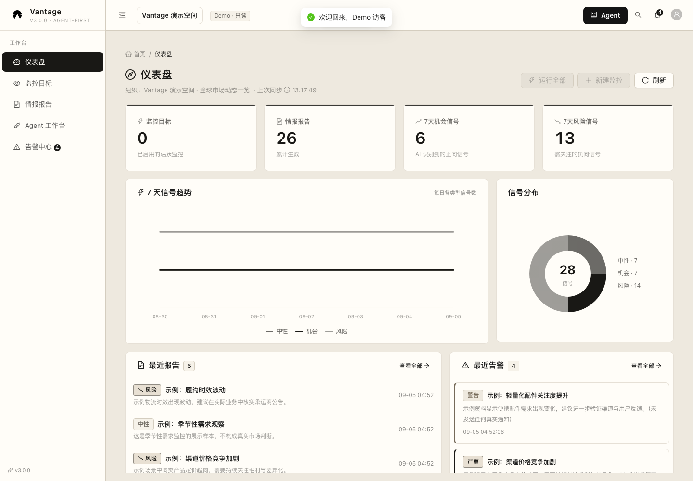
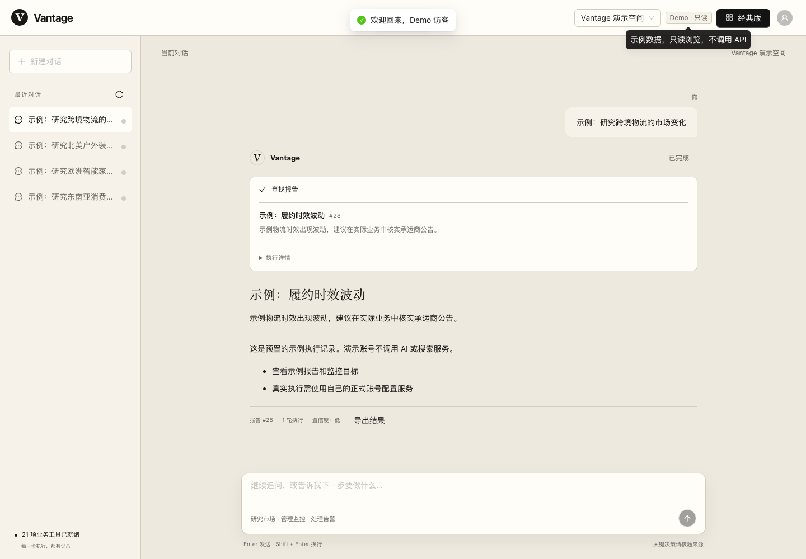
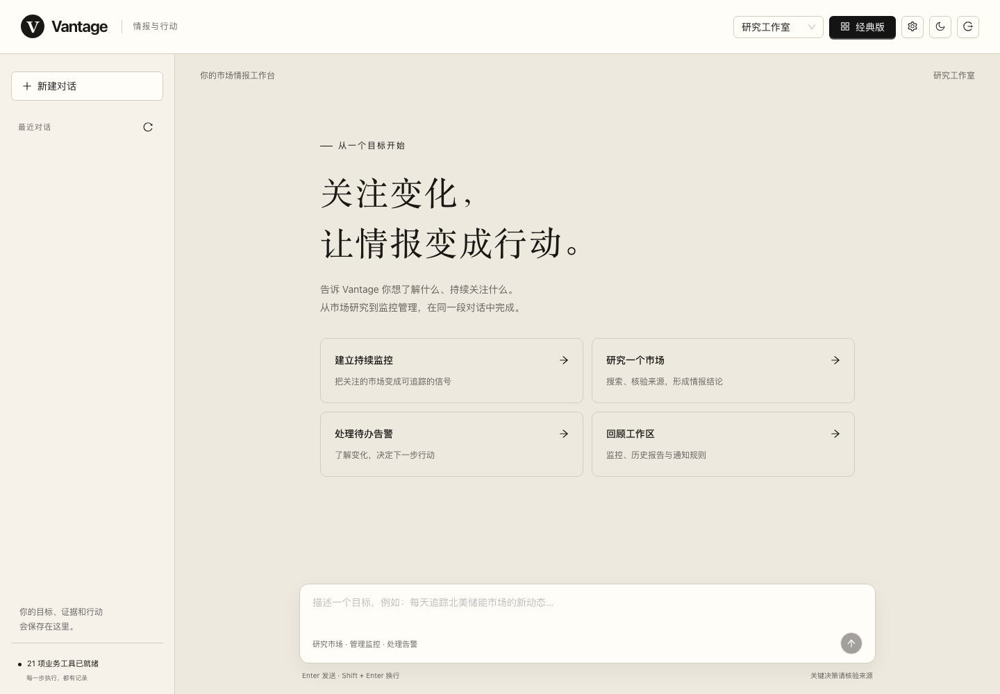
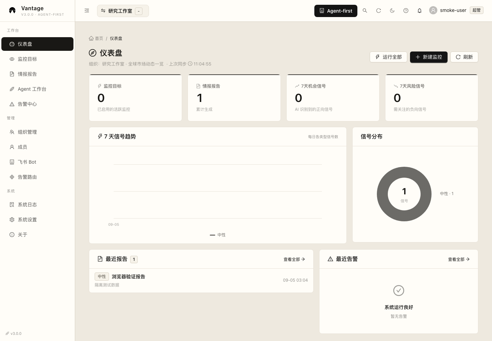
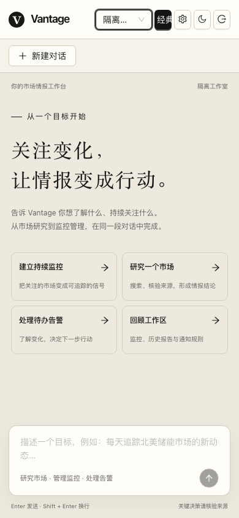
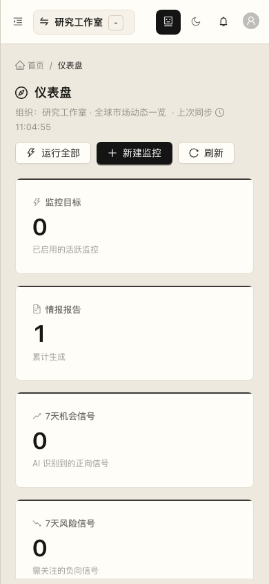
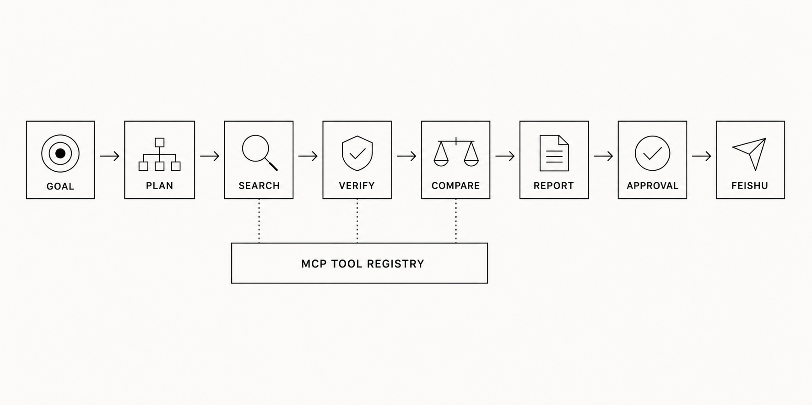
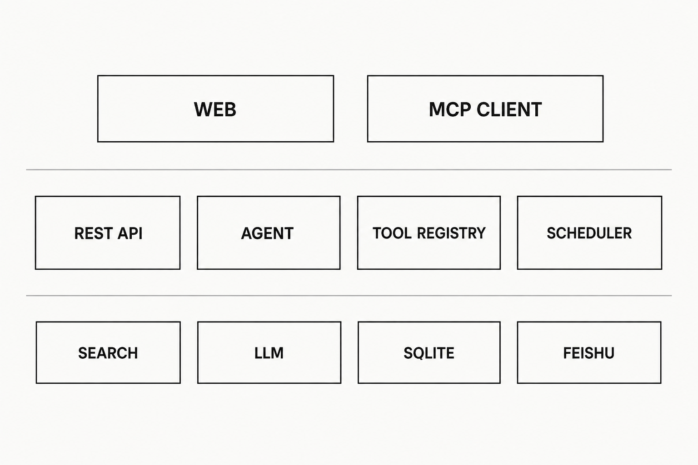

<p align="center">
  <picture>
    <source media="(prefers-color-scheme: dark)" srcset="./web/public/vantage-logo-white.png" />
    
  </picture>
</p>

<h1 align="center">Vantage · 跨境瞭望台</h1>

<p align="center">
  <strong>让 Agent 接住市场研究、持续监控与告警处置，再把每一步留在可核验的业务轨迹里。</strong><br />
  <sub>Agent-first · 经典工作台 · D1 · R2 · Hono · Queues · MCP · 飞书审批</sub>
</p>

<p align="center">
  
  
  
  
  
  <a href="./LICENSE"></a>
</p>

Vantage 是一个可自行部署的市场情报应用。登录后默认进入 Agent-first 工作台：用户只需描述目标，Agent 就能查询业务、创建和运行监控、研究公开市场、比较报告、处理告警和维护通知规则。顶部按钮可随时切换到经典管理界面，两种模式共用账户、组织与后端数据。

[产品界面](#产品界面) · [核心能力](#核心能力) · [Agent 如何工作](#agent-如何工作) · [快速开始](#快速开始) · [配置](#配置) · [验证](#验证) · [安全与开源](#安全与开源)

## 在线体验

**[产品展示页](https://vantage.limnov.com/) · [登录 Demo](https://vantage.limnov.com/demo) · [正式工作台](https://vantage.limnov.com/app)**

当前 `aliyun` 分支使用阿里云服务器运行 Node.js、SQLite 和常驻 Agent Worker，Cloudflare 负责域名代理与 HTTPS。产品展示页、真实工作台和 Demo 共用站点，无需开通 Workers Paid。[服务器部署说明 →](./deploy/aliyun/README.md)

**演示账号：`demo` / 密码：`demo`。** Demo 登录正式界面，复用仪表盘、监控、报告、告警和 Agent 历史；数据来自独立演示组织。账号只读，不提供 API Key，不执行真实模型、搜索或通知，也不能访问正式组织的数据。

| 真实仪表盘 Demo | Agent 历史 Demo |
| --- | --- |
|  |  |

## Cloudflare 适配分支

`cloudflare` 分支保留 D1 / R2 / Hono / Queues 方案；`main` 保留此前的 Node 自托管基线。以下是 Cloudflare 适配能力，当前线上正式业务使用上述阿里云部署。完整 Cloudflare 后端仍需满足该分支文档中的 Workers 套餐和资源要求。

| 服务 | 职责 |
| --- | --- |
| Workers + Hono | 公网 API 入口、鉴权业务路由适配、安全响应头 |
| D1 | 业务数据、会话、Agent 轨迹、审批、持久限流与任务状态 |
| R2 | 私有报告归档，按登录用户及组织校验下载 |
| Queues + Cron Triggers | Agent 与监控任务、重复认领保护、待处理任务补发 |
| Static Assets | React 产品与预渲染展示页（Demo 以相应分支实现为准） |
| Secrets | 模型、搜索及全局通知配置 |

Hono 入口通过 Cloudflare 官方 Node HTTP 适配器复用现有 Express 业务路由，保留组织权限和业务工具。[完整部署步骤与运行边界 →](./docs/cloudflare-deployment.md)

```bash
npm ci --prefix server
npm ci --prefix web
npm ci --prefix cloudflare
cd cloudflare
npm run build:web
npm test
# 创建资源、填写私有配置并应用 D1 迁移后：
npm run deploy
```

## 产品界面

| Agent-first（默认入口） | 经典管理界面 |
| --- | --- |
|  |  |

两个版本采用统一的黑、白、米色视觉系统，并支持明暗主题。Agent 模式使用 `/app`，经典仪表盘使用 `/dashboard`；刷新与直接访问链接都保留相应界面。

<p align="center">
  
  &nbsp;&nbsp;&nbsp;
  
</p>

## 核心能力

| 模块 | 当前实现 |
| --- | --- |
| Agent-first 入口 | 自然语言目标、连续追问、对话历史、执行轨迹、业务对象卡片、来源与审批状态 |
| 市场监控 | 创建、修改、暂停、恢复、删除与立即执行；支持新闻、商品和通用搜索模式 |
| 情报研究 | 公开市场搜索、网页原文核验、报告保存、来源质量统计和历史比较 |
| 告警处置 | 查询告警并确认或忽略，保留组织与操作者边界 |
| 通知治理 | 管理组织 Bot 路由；Agent 只提出通知建议，由 `owner/admin` 独立批准 |
| 多组织协作 | 组织、成员和 `owner / admin / member / viewer` 角色；数据库实时校验成员关系 |
| 身份与会话 | 自助注册默认关闭；Access/Refresh Token 绑定持久会话，登出和改密会撤销会话 |
| 经典工作台 | Dashboard、监控、报告、告警、组织、系统设置与运行日志，按页面加载 |
| 开发者接口 | REST API、HTTP/stdio MCP，与内部 Agent 共用 21 个 Zod 工具契约 |
| 任务执行 | Cloudflare Queues + D1 原子认领、取消和过期失败保护；Node 版使用 SQLite 持久队列 |

## Agent 如何工作

<p align="center">
  
</p>

用户可以直接提出完整业务目标，例如：

- 「每天早上 9 点追踪北美便携储能市场，先创建并暂停监控。」
- 「查看现有监控，把储能市场的搜索模式改成新闻并启用。」
- 「立即运行这个监控，比较最近两份报告。」
- 「研究最近一个月的市场机会，核验关键来源。」
- 「列出未处理告警，把第 12 条标记为已确认。」
- 「将风险信号路由到采购群机器人。」
- 「建议把这份报告发到飞书。」

Agent 与 MCP 共用同一套参数校验、权限判断和业务实现：

| 能力 | 工具 |
| --- | --- |
| 工作区概况 | `get_workspace` |
| 监控查询与管理 | `list_watchlists`、`create_watchlist`、`update_watchlist`、`delete_watchlist`、`run_watchlist` |
| 市场研究与原文核验 | `search_market`、`extract_source` |
| 报告查询与比较 | `list_reports`、`get_report`、`get_report_history`、`compare_reports` |
| 告警查询与处置 | `list_alerts`、`update_alert` |
| 通知路由管理 | `list_notification_routes`、`create_notification_route`、`update_notification_route`、`delete_notification_route` |
| 通知审批建议 | `propose_notification` |
| 成员查询 | `list_members` |
| 安全配置引导 | `configure_workspace` |

新增监控默认暂停。用户明确要求启用后，调度器按监控自己的五段 cron 运行。每轮 Agent 任务最多提出一个飞书通知建议；Agent 和 MCP 都没有批准工具，真正发送必须由 `owner/admin` 在结果卡片中单独批准。

研究内容和网页正文始终按不可信数据处理。网页提取只接受公开 HTTP(S) 目标，并拒绝私网、保留地址、带凭据 URL 和未经复验的重定向。

## 系统结构

下面展示共享业务分层与 Node 自托管结构。Cloudflare 对应 D1 / Queues / R2，详见[云端架构](./docs/cloudflare-deployment.md#架构)。

<p align="center">
  
</p>

```text
Agent-first / 经典工作台 / MCP Client
                 ↓ JWT + 当前组织
         REST API 与 Tool Registry
                 ↓
SQLite 任务队列（原子领取、租约心跳、崩溃恢复）
                 ↓
Agent Runner（连续上下文、工具预算、取消检查、执行记录）
          ↙              ↓               ↘
   搜索与原文提取     SQLite 业务数据      OpenAI-compatible LLM
          ↓              ↓
       报告与证据     待审批通知 ── 人工批准 ──→ 飞书
```

- `server/src/agent/businessTools.js`：21 个业务工具、参数验证和实时权限检查。
- `server/src/agent/runner.js`：模型循环、连续上下文、证据绑定和执行结果。
- `server/src/agent/queue.js`：任务持久化、并发领取、租约心跳和安全恢复。
- `server/src/agent/store.js`：对话、轨迹、报告和待审批动作持久化。
- `server/src/routes/agent.js`：异步任务、历史、SSE、取消和审批 API。
- `web/src/pages/Agent.tsx`：对话历史、结果卡片、执行状态和审批界面。
- `web/src/components/SecureSetup.tsx`：凭据独立提交表单，不经过模型上下文。

## 快速开始

**Cloudflare 部署请使用[云端部署指南](./docs/cloudflare-deployment.md)。以下步骤运行本机 Node / SQLite 版本。**

### 环境要求

- Node.js `22.12.0+`
- npm
- 可选：支持 OpenAI-compatible Tool Calling 的模型、Tavily API Key、飞书 Webhook

### 1. 安装依赖并创建配置

```bash
git clone https://github.com/Limnov/Vantage.git
cd Vantage
npm run setup
cp server/.env.example server/.env
```

为 `JWT_SECRET` 和 `JWT_REFRESH_SECRET` 分别生成不同的随机值，并在 `server/.env` 中设置至少 12 位的非默认 `ADMIN_PASSWORD`：

```bash
openssl rand -hex 32
```

### 2. 初始化数据并启动

```bash
npm --prefix server run db:migrate
npm run dev
```

| 服务 | 默认地址 |
| --- | --- |
| Web | <http://127.0.0.1:5177> |
| API | <http://127.0.0.1:3004> |
| 健康检查 | <http://127.0.0.1:3004/health> |

局域网访问需要使用强管理员密码，并显式声明监听地址、Web 主机与 CORS 来源。将示例 IP 替换为运行机器的局域网地址：

```bash
HOST=0.0.0.0 \
CORS_ORIGINS=http://192.168.31.251:5177 \
ALLOW_INSECURE_DEV_ADMIN=false \
VANTAGE_WEB_HOST=0.0.0.0 \
VANTAGE_WEB_ALLOWED_HOSTS=192.168.31.251 \
npm run dev
```

Windows 可运行根目录的 `start.ps1`。前后端启动后，使用 `Ctrl+C` 停止；也可运行 `stop.ps1` 清理残留进程。

## 配置

Cloudflare 版通过 `cloudflare/secrets.mjs` 或 `wrangler secret put` 配置模型和搜索；页面只读，普通业务设置保存在 D1。下面描述 Node 自托管版本。

首次登录后，可在右上角「连接配置」中填写模型、搜索和飞书连接。密钥通过独立表单直接发送到后端，不进入模型消息，也不会写入 SQLite；运行时接口只返回脱敏状态。

```dotenv
AI_PROVIDER_NAME=MyProvider
AI_BASE_URL=https://your-provider.example/v1
AI_MODEL=your-tool-calling-model
AI_API_KEY=your-secret-key
TAVILY_API_KEY=your-search-key
```

也支持已有 Bailian、DeepSeek 和 MiniMax 环境配置。完整变量见 [`server/.env.example`](./server/.env.example)。数据库默认位于 `server/data/vantage.sqlite`。

Agent Worker 可按部署容量调整：

```dotenv
AGENT_WORKER_CONCURRENCY=1
AGENT_WORKER_LEASE_SECONDS=120
AGENT_WORKER_POLL_MS=500
AGENT_MAX_TOOL_CALLS_PER_STEP=4
AGENT_TOOL_CONTEXT_MAX_CHARS=20000
```

Runner 会重放同一状态下已成功的重复工具调用，避免模型重复创建或修改资源；任意新的写操作都会让旧重放结果失效。工具完整输出保存在执行轨迹中，送回模型的副本会按字符预算压缩，防止长列表或正文持续放大上下文。

同一 SQLite 文件上的多个 Worker 通过原子领取避免重复执行。租约过期时，只读任务可自动重跑；已经成功执行写工具的任务会失败关闭并保留轨迹，避免重复产生业务副作用。

### MCP

HTTP MCP 入口为 `/mcp`，需要 Vantage JWT 和 `X-Org-ID`。本地 stdio 客户端可在 `server/` 下启动：

```bash
MCP_ORG_ID=1 MCP_USER_ID=1 npm run mcp
```

stdio 进程继承启动者提供的用户和组织上下文，只适合受信任的本机客户端。

## 验证

Cloudflare 验证：`npm test --prefix cloudflare`（事务/隔离/恢复），`npm run test:smoke --prefix cloudflare`（实际 API），`npm run test:browser --prefix cloudflare`（展示页与独立 Demo）。命令前置条件及真实模型测试见[部署指南](./docs/cloudflare-deployment.md#本地验证)。

共享业务验证：

```bash
npm run check       # 后端测试 + 前端生产构建 + 离线 Agent 评测
npm run test:ui     # 真实 HTTP / SQLite / 浏览器流程
npm run test:live   # 真实模型的临时只读业务任务
```

最近一次验收结果（2026-09-05）：

| 检查 | 结果 |
| --- | --- |
| 后端自动化测试 | 42 / 42 通过 |
| 离线 Agent 质量套件 | 6 / 6 通过 |
| 真实模型只读套件 | 3 / 3 通过，工具选择率 100% |
| 浏览器端到端流程 | 15 / 15 通过 |
| TypeScript 与生产构建 | 通过，经典页面分包均低于 500 KB 告警阈值 |
| npm 生产依赖审计 | Server / Web 均为 0 个已知漏洞 |

浏览器测试使用固定模型和通知夹具，不会向真实飞书群发消息。真实模型测试可能计入 Provider 用量，但每个场景只暴露一个只读业务工具，不执行市场搜索或写操作。

## 权限与执行边界

- `viewer` 可查询；`member` 可创建监控、操作自己创建的监控和处理告警；`owner/admin` 可管理组织监控和通知规则。
- 每个业务工具执行时重新读取数据库成员关系；模型提供的角色或组织参数不能改变权限。
- 密钥配置只允许系统管理员，组织 Bot 配置只允许 `owner/admin`。成员与组织管理仍使用专用 REST API。
- 手动运行监控使用 `silent: true`，只生成报告和告警；定时任务沿用已有通知路由。
- 停止任务会阻止后续工具调用，已经执行的操作保留；正在进行的网络请求不保证立即中断。
- MCP stdio 拥有启动者赋予的本机身份，只应交给可信进程。

## 安全与开源

Vantage 是自托管应用。公网部署前应配置 HTTPS、可信 `CORS_ORIGINS` 和网关限流，并为 Access Token 与 Refresh Token 使用不同的强随机密钥。API Key、Webhook、数据库文件、日志和本地 `.env` 不应提交到 Git。Cloudflare 资源 ID 不是授权凭据；密钥与管理员密码仅保存在忽略文件和云端 Secrets / D1 密码哈希中。MIT 许可覆盖项目原创代码，第三方依赖和外部服务仍遵循各自条款。

安全默认值：

```dotenv
REGISTRATION_MODE=disabled
TRUST_PROXY=false
JWT_EXPIRES_IN=15m
JWT_REFRESH_EXPIRES_IN=7d
```

- 只有明确需要自助注册时才设置 `REGISTRATION_MODE=open`，公网环境还应增加验证码、邀请制或组织级成本配额。
- 直连后端时保持 `TRUST_PROXY=false`；示例 Nginx 是单层可信代理，应设置 `TRUST_PROXY=1`，并由代理覆盖客户端传入的 `X-Forwarded-For`。
- 登录会创建可撤销的 SQLite 会话；登出和改密会立即撤销相应会话。升级后旧版无会话标识的 Token 会失效，需要重新登录。
- 全局运行日志、搜索分析和缓存管理仅限系统管理员；外部通知、Bot 测试及 Agent 写操作执行最小角色检查。

Node 自托管版的内置限流与 MCP 传输会话保存在单进程内，登录会话和 Agent 队列保存在 SQLite。多个 Worker 必须访问同一个本机 SQLite 文件；跨主机水平扩展需要外部队列、共享 MCP 会话与统一限流。该 Node 模式需要自行配置 TLS 和密钥管理。Cloudflare 分支使用 HTTPS 自定义域名、Secrets、D1 限流和无状态 MCP；两种版本均需部署者负责账户、备份和费用管理。

项目以 [MIT License](./LICENSE) 开源。发布前与每次安全事件后，都应重新扫描当前树和全部可达 Git 历史，并轮换任何可能暴露的凭据。安全问题请按 [`SECURITY.md`](./SECURITY.md) 的方式私下报告。

## 项目结构

```text
Vantage/
├── server/
│   ├── src/agent/           # Agent Runner、持久队列、工具和执行记录
│   ├── src/mcp/             # HTTP / stdio MCP
│   ├── src/routes/          # REST API
│   ├── src/security/        # 启动配置与出站请求边界
│   ├── src/collectors/      # Tavily 与市场采集
│   ├── src/searnov/         # 搜索增强、网页提取、缓存与 AI 摘要
│   ├── src/push/            # 飞书发送链路
│   ├── src/scheduler/       # 定时任务
│   └── test/                # Node.js 测试
├── web/                     # Agent-first 与经典 React 工作台
├── cloudflare/              # Hono Worker、D1 适配、R2、Queues 与云端迁移
├── db/                      # Node 版 SQLite schema 与迁移
├── docs/                    # 重构说明与 Agent 设计资料
├── assets/readme/           # README 产品截图与架构图
└── README.md
```

[Agent-first 重构说明](./docs/agent-first-refactor.md) · [Agent 设计与面试说明](./docs/agent-interview.md) · [安全策略](./SECURITY.md) · [GitHub 仓库](https://github.com/Limnov/Vantage)

---

<p align="center">
  Built by <a href="https://github.com/Freakz2z">Freakz2z</a>
</p>
